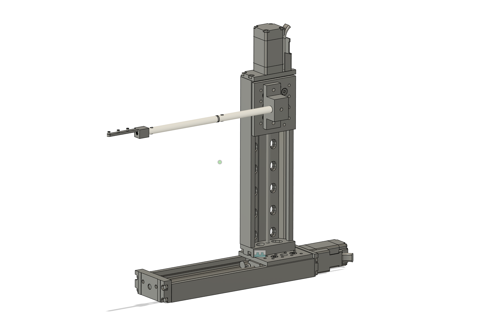

# DrosoMenuPro

A stimulus delivery device for head-fixed flies. Can be remotely triggered via digital and analog inputs (any DAQ) or via serial communication (MATLAB, Python, Bonsai etc.).

## Electronics Scheme

## Shopping List

| Item | Order Nr. | Link to Supplier | Amount | Price | Notes |
| --- | --- | --- | --- | --- | --- |
| Zaber X-Series Shield for Arduino | X-AS01 | [Link](https://www.zaber.com/products/accessories/X-AS01) | 1-2 | 129.- USD | One extra would be good in case of damage (has happened before) |
| Zaber Data Cable | X-DC02 | [Link](https://www.zaber.com/products/accessories/X-DC02) | 1 | 15.- USD | Connecting Shield to Stage |
| Zaber XY-Stage (2x X-LSM100B-E03) | Configurator | [Link](https://www.zaber.com/products/xy-xyz-motorized-stages/LSM-XY-XYZ/configurator/XY-LSM?XTRAVEL=100&YTRAVEL=100&XYPITCH=B&ENCODER=yes&XMCC=none&ESTOP=no&JOY=no) | 1 | 5905.- USD | XY-Axis Travel 100mm, Lead Screw Pitch B (medium), Built-in encoders true, integrated controller |
| Thorlabs Mini-Series Optical Post | MS3R/M | [Link](https://www.thorlabs.com/item/MS3R_M) | 2 | 9.02 EUR | For holding stimuli |
| USB Cable |  | [Link]() |  |  |  |
| Arduino Uno R4 minima |  | [Link]() |  |  |  |
| BNC Connectors |  | [Link]() |  |  |  |
| BNC Cables |  | [Link]() |  |  |  |
| Calibration Button |  | [Link]() |  |  |  |

Jumper Cables

Button already on Shield

### Custom Designed Parts
| Item | Link to File | Material | Amount | Price | Alternative | Notes |
| --- | --- | --- | --- | --- | --- | --- |
| BIT-Boy | [Link]() |  |  |  |  | For Debugging (should be in Lab already) |
| Optical Post Bracket | [Link]() |  |  |  |  |  |
| Stimulus Holder | [Link]() |  |  |  |  |  |

## Cost Estimation for Rundum-Sorglos-Paket

| Item | Price (incl. 19% VAT) |
| --- | --- |
| Hardware Equipment | ?? EUR |
| Custom Designed Parts, Manufactured at CADRE | ?? EUR |
| Hourly Rate | 129.14 EUR* |
| Daily Rate (8h) | 993.54 EUR* |
| Weekly Rate (40h) | 4967.70 EUR* |
| Accommodation and Travel Expenses (estimated with standard UKB rates) | ?? EUR |
| Total |  |

\* Costs for work hours and consulting are pending final internal assessment.