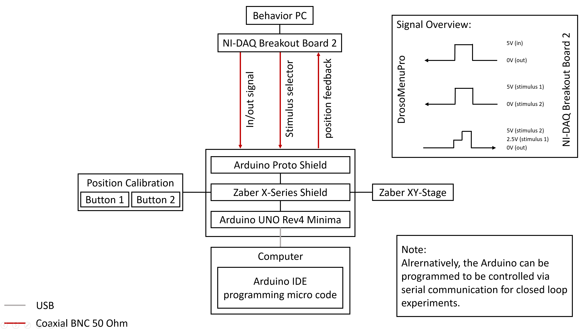

# DrosoMenuPro

A stimulus delivery device for head-fixed flies. Can be remotely triggered via digital and analog inputs (any DAQ) or via serial communication (MATLAB, Python, Bonsai etc.).

**Figure 1:** DrosoMenuPro Device for stimulus delivery to head-fixed flies.

## Electronics Scheme

**Figure 2:** Schematic illustration of how the DrosoMenuPro can be integrated into existing behavior setups.

## Shopping List

| Item | Order Nr. | Link to Supplier | Amount | Price | Notes |
| --- | --- | --- | --- | --- | --- |
| Zaber X-Series Shield for Arduino | X-AS01 | [Link](https://www.zaber.com/products/accessories/X-AS01) | 1-2 | 129.- USD | One extra would be good in case of damage (has happened before) |
| Zaber Data Cable | X-DC02 | [Link](https://www.zaber.com/products/accessories/X-DC02) | 1 | 15.- USD | Connecting Shield to Stage |
| Zaber XY-Stage (2x X-LSM100B-E03) | Configurator | [Link](https://www.zaber.com/products/xy-xyz-motorized-stages/LSM-XY-XYZ/configurator/XY-LSM?XTRAVEL=100&YTRAVEL=100&XYPITCH=B&ENCODER=yes&XMCC=none&ESTOP=no&JOY=no) | 1 | 5905.- USD | XY-Axis Travel 100mm, Lead Screw Pitch B (medium), Built-in encoders true, integrated controller |
| Thorlabs Mini-Series Optical Post | MS3R/M | [Link](https://www.thorlabs.com/item/MS3R_M) | 2 | 9.02 EUR | For holding stimuli |
| Arduino Uno R4 minima | ABX00080 | [Link](https://www.conrad.de/de/p/arduino-abx00080-board-uno-rev4-minima-2865738.html?insert=VQ) | 1 | 21,42 EUR |  |
| BNC Connectors | 1570975 - VQ | [Link](https://www.conrad.de/de/p/tru-components-lt-bnc-f-bnc-steckverbinder-buchse-gerade-50-1-st-1570975.html?insert=VQ) | 5 | 3,49 EUR | For initial prototype without case |
| USB Cable | 1460360 - VQ | [Link](https://www.conrad.de/de/p/renkforce-usb-kabel-usb-3-2-gen1-usb-a-stecker-usb-c-stecker-1-00-m-schwarz-vergoldete-steckkontakte-rf-4381080-1460360.html?insert=VQ) | 1 | 7,49 EUR | For programming Arduino |
| Arduino Proto Shield | 1969858 - VQ | [Link](https://www.conrad.de/de/p/arduino-proto-shield-entwicklungsboard-1969858.html?insert=VQ) | 1 | 14,59 EUR | For soldering cables etc. |
| Jumper Kables Kit | 2481791 - VQ | [Link](https://www.conrad.de/de/p/tru-components-jumper-kabel-arduino-1x-drahtbruecken-buchse-1x-drahtbruecken-buchse-bunt-2481791.html?insert=VQ) | 1 | 4,79 EUR |  |
| USB Cable | 2299844 - VQ | [Link](https://www.conrad.de/de/p/renkforce-jkmf403-jumper-kabel-arduino-banana-pi-raspberry-pi-40x-drahtbruecken-stecker-40x-drahtbruecken-buchse-30-2299844.html?insert=VQ) | 1 | 3,29 EUR |  |
| BNC Cables | N.A. | N.A. | N.A. | N.A. | If not available order more |

> [!NOTE]
> It would be beneficial to have the Optogenetics Upgrade ready at the same time to have the extra I/O ports for extra capacity. Then all the devices can be connected at the same time. 

### Custom Designed Parts
| Item | Link to File | Material | Amount | Price | Alternative | Notes |
| --- | --- | --- | --- | --- | --- | --- |
| BIT-Boy | [Link]() |  |  |  |  | For Debugging (should be in Lab already) |
| Optical Post Bracket | [Link]() |  |  |  |  |  |
| Stimulus Holder | [Link]() |  |  |  |  |  |

## Cost Estimation for Rundum-Sorglos-Paket

| Item | Price (incl. 19% VAT) |
| --- | --- |
| Hardware Equipment | ?? EUR |
| Custom Designed Parts, Manufactured at CADRE | ?? EUR |
| Hourly Rate | 129.14 EUR* |
| Daily Rate (8h) | 993.54 EUR* |
| Weekly Rate (40h) | 4967.70 EUR* |
| Accommodation and Travel Expenses (estimated with standard UKB rates) | ?? EUR |
| Total |  |

\* Costs for work hours and consulting are pending final internal assessment.